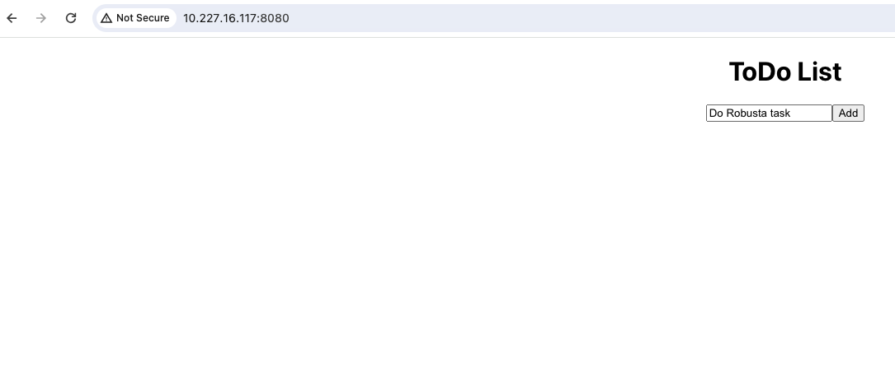
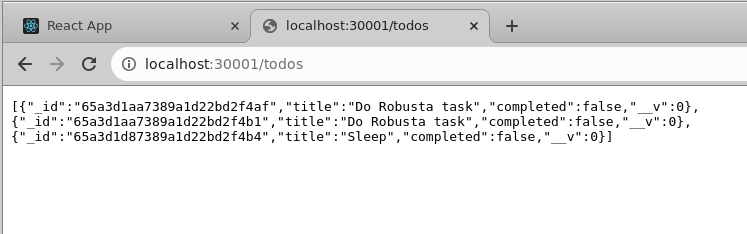
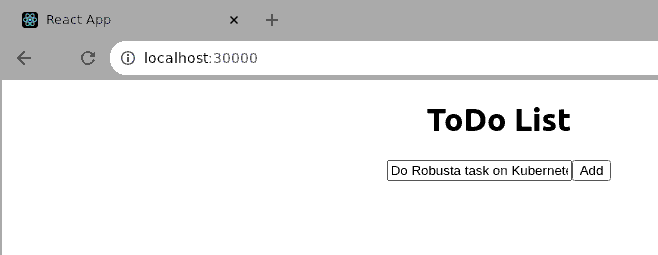
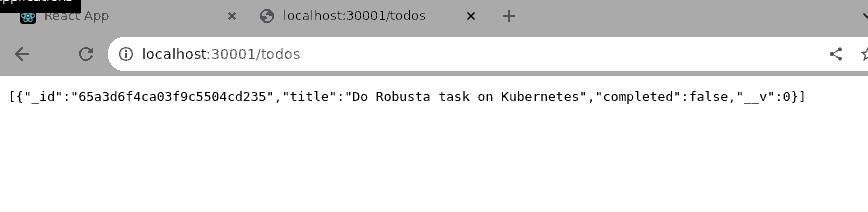

# robusta-task

This guide provides detailed instructions on how to deploy the TodoApp using different types of deployments such as Docker compose or Kubernetes Cluster.

## Assumputions
* Due to the lack of resources I deployed the app locally on my laptop.
* I used Docker for creating the app and Kubernetes on Docker or MiniKube for running the app on Kubernetes.
* Deployment on a single Cluster Kubernetes node. In production envrionment I would deploy the frontend in a DMZ zone and for the database and the backend I would deploy them in a separate environment which not reachable for outside user but can reach the frontend environment.
* The application consistes of frontend, backend and Database.
* I used MongoDB as a Database.
* I used NodePort Service to access the application. In a production environment I would consider using LoadBalancer Service for the frontEnd
* I used NodePort Service to access the backend. In a production environment I would consider using ClusterIP Service for the backend

## Deployment Using Docker with docker-compose

### Step 1: Clone the Repository

Clone the TodoApp repository to your local machine.
```
$ git clone [repository URL]
$ cd robusta-task
```

### Step 2: Run the docker-compose
Run the docker-compose script inside the repository

```
$ ./docker-compose-linux-x86_64 up --build
```

### Step 3: Confirm the containers are up and running:

Confirm that you have 3 containers up and running (frontend, backend and database)

```
$ docker ps
CONTAINER ID   IMAGE                   COMMAND                  CREATED          STATUS          PORTS                                           NAMES
c3c4a3536d21   robusta-task-frontend   "/docker-entrypoint.…"   27 seconds ago   Up 25 seconds   0.0.0.0:8080->80/tcp, :::8080->80/tcp           robusta-task-frontend-1
3ec62bab0217   robusta-task-backend    "docker-entrypoint.s…"   27 seconds ago   Up 25 seconds   0.0.0.0:3001->3000/tcp, :::3001->3000/tcp       robusta-task-backend-1
82fafa2a1b02   mongo                   "docker-entrypoint.s…"   27 seconds ago   Up 25 seconds   0.0.0.0:27017->27017/tcp, :::27017->27017/tcp   robusta-task-database-1
```

### Step 4: Access the application

The application is accessible through the url http://localhost:8080



Confirm that the information is sent to the backend by using the url http://localhost:30001/todos




## Deployment Using Kubernetes

### Step 1: Clone the Repository

Clone the TodoApp repository to your local machine.
```
$ git clone [repository URL]
$ cd robusta-task/todo-k8
```

### Step 2: Create the Database deployment

Inside the todo-k8 directory create the database deployment and service

```
$ kubectl create -f mongodb-deployment.yaml
$ kubectl create -f mongodb-service.yaml
```

Verify that the pod is up and running

```
$ kubectl get pod
NAME                       READY   STATUS    RESTARTS   AGE
mongodb-7dcbb4bfc9-6l7x5   1/1     Running   0          44s
```

Verify that the service is up and running

```
$ kubectl get svc
NAME         TYPE        CLUSTER-IP   EXTERNAL-IP   PORT(S)     AGE
mongodb      ClusterIP   10.96.3.69   <none>        27017/TCP   45s
```

### Step 3: Create the Backend deployment

Inside the todo-k8 directory create the backend deployment and service

```
$ kubectl create -f backend-deployment.yaml
deployment.apps/todo-backend created
```

```
$ kubectl create -f backend-service.yaml
service/todo-backend created
```

Verify that the pod is up and running

```
$ kubectl get pod
NAME                            READY   STATUS    RESTARTS   AGE
mongodb-7dcbb4bfc9-6l7x5        1/1     Running   0          5m27s
todo-backend-5dbffd69b9-lhtjh   1/1     Running   0          2m41s
```

Verify that the service is up and running


```
$ kubectl get svc
NAME           TYPE        CLUSTER-IP      EXTERNAL-IP   PORT(S)          AGE
kubernetes     ClusterIP   10.96.0.1       <none>        443/TCP          69m
mongodb        ClusterIP   10.96.3.69      <none>        27017/TCP        5m34s
todo-backend   NodePort    10.105.64.129   <none>        3000:30001/TCP   2m45s
```

### Step 4: Create the Frontend deployment

Inside the todo-k8 directory create the frontend deployment and service

```
$ kubectl create -f frontend-deployment.yaml
deployment.apps/todo-frontend created
```

```
$ kubectl create -f frontend-service.yaml
service/todo-frontend created
```

Verify that the pod is up and running

```
$ kubectl get pod
NAME                             READY   STATUS    RESTARTS   AGE
mongodb-7dcbb4bfc9-6l7x5         1/1     Running   0          8m47s
todo-backend-5dbffd69b9-lhtjh    1/1     Running   0          6m1s
todo-frontend-66dd4856f7-hxmpm   1/1     Running   0          69s
```

Verify that the service is up and running

```
 kubectl get svc
NAME            TYPE        CLUSTER-IP       EXTERNAL-IP   PORT(S)          AGE
kubernetes      ClusterIP   10.96.0.1        <none>        443/TCP          72m
mongodb         ClusterIP   10.96.3.69       <none>        27017/TCP        8m38s
todo-backend    NodePort    10.105.64.129    <none>        3000:30001/TCP   5m49s
todo-frontend   NodePort    10.107.226.111   <none>        80:30000/TCP     62s
```

### Step 5: Access the application

The frontend application is accessible on http://localhost:30000



The backend application is accessible on http://localhost:30001/todos

